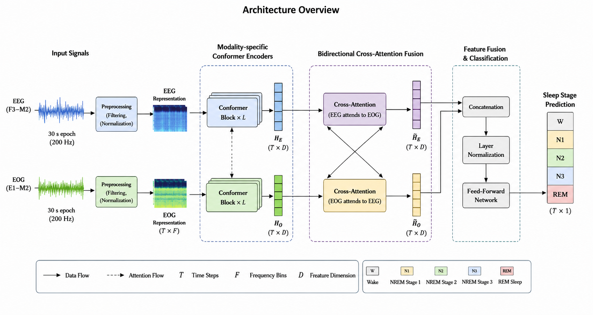

# CrossSleepNet

<p align="center">
  
</p>

<p align="center">
<b>Conformer-based Bidirectional EEG–EOG Cross-Attention for Automated Sleep Staging</b>
</p>

<p align="center">
Multimodal sleep staging framework combining EEG, EOG, cross-attention fusion,
time-frequency encoding, and sequence-level temporal modelling.
</p>

---

## Overview

CrossSleepNet is a multimodal deep learning framework for automatic sleep stage
classification using:

- EEG Fpz-Cz
- EEG Pz-Oz
- Horizontal EOG

The model follows the AASM 5-stage sleep scoring protocol:

- Wake
- N1
- N2
- N3
- REM

CrossSleepNet introduces a **bidirectional EEG–EOG cross-attention mechanism**
that explicitly models neural–ocular interactions between EEG and EOG signals,
combined with:

- Conformer-based temporal encoding
- STFT time-frequency representations
- Sequence-level Transformer context modelling

---

## Architecture

### Input

- Sequence length: **L = 20 epochs**
- Epoch duration: **30 seconds**
- Sampling frequency: **100 Hz**

### Processing Pipeline

```text
EEG  (2 × 3000)   ──▶ ConformerEncoder ──┐
                                         │
EOG  (1 × 3000)   ──▶ ConformerEncoder ──┤
                                         ├──▶ Bidirectional EEG-EOG Cross-Attention
STFT (3 × 29×128) ─▶ TFImageEncoder ────┘
                                                   │
                                                   ▼
                                      Level-3 multimodal fusion
                                                   │
                                                   ▼
                                  Sequence Transformer over epochs
                                                   │
                                                   ▼
                                   Centre-epoch sleep classification
```

---

## Core Components

### ConformerEncoder

Macaron-style Conformer blocks combining:

- Multi-head self-attention
- Depthwise convolution
- Multi-scale patch tokenisation

Designed to jointly capture:

- Local transient sleep events
- Long-range temporal dependencies

---

### EEG–EOG Cross-Attention

The central contribution of CrossSleepNet.

Bidirectional cross-attention enables:

- EEG attending to EOG
- EOG attending to EEG

This allows the network to learn physiological coupling patterns associated with:

- REM eye movements
- Sleep transitions
- Stage-dependent neuro-ocular dynamics

---

### TFImageEncoder

Processes log-transformed STFT spectrograms using:

- 2D CNN frontend
- Transformer encoder with CLS token

Captures complementary spectral structure not explicitly represented in raw temporal patches.

---

### Sequence Transformer

Temporal Transformer operating across consecutive epochs.

Uses bidirectional contextual modelling for centre-epoch prediction.

---

## Results

### Sleep-EDF-78 (10-fold subject-wise CV)

| Model                     | κ      | ±std   | MF1    | Accuracy |
|---------------------------|--------|--------|--------|----------|
| CrossSleepNetV10 (full)   | 0.7527 | 0.0339 | 0.7803 | 0.8199   |
| w/o EEG-EOG cross-attn    | 0.7371 | 0.0381 | 0.7687 | 0.8066   |
| w/o STFT branch           | 0.7375 | 0.0278 | 0.7655 | 0.8080   |
| EEG only (baseline)       | 0.6967 | 0.0232 | 0.7299 | 0.7783   |

### Sleep-EDF-20 (10-fold subject-wise CV)

| Model              | κ      | ±std   | MF1    | Accuracy |
|--------------------|--------|--------|--------|----------|
| CrossSleepNetV10   | 0.7974 | 0.0561 | 0.8256 | 0.8519   |

---

## Installation

```bash
pip install -r requirements.txt
```

## Dataset

Download Sleep-EDF Expanded from PhysioNet:

```text
https://physionet.org/content/sleep-edfx/1.0.0/
```

Expected files:

- `*PSG.edf`
- `*Hypnogram.edf`

Supported subsets:

- Sleep-EDF-78
- Sleep-EDF-20

---

## Training

### Sleep-EDF-78

```bash
python train.py --data_dir /path/to/sleep-edf --dataset edf78
```

### Sleep-EDF-20

```bash
python train.py --data_dir /path/to/sleep-edf --dataset edf20
```

### Custom output directory

```bash
python train.py --data_dir /path/to/sleep-edf --output_dir ./my_outputs
```

### Ablation study

```bash
python train.py --data_dir /path/to/sleep-edf \
    --models CrossSleepNetV10 CrossSleepNetV10_NoCross \
             CrossSleepNetV10_NoTF SeqTrans-EEG
```

---

## Evaluation

```bash
python evaluate.py --checkpoint results/v10_checkpoint.json
```

Outputs:

- Per-fold metrics
- Mean ± std summary
- Per-class F1
- Confusion matrices

---

## Repository Structure

```text
CrossSleepNet/
├── config.py
├── train.py
├── evaluate.py
├── requirements.txt
├── architecture_overview.png
├── models/
├── data/
├── utils/
└── results/
```

---

## Citation

```bibtex
@article{crosssleepnet2026,
  title={CrossSleepNet: Bidirectional EEG-EOG Cross-Attention for Automated Sleep Staging},
  author={Your Name},
  journal={Under Review},
  year={2026}
}
```

---

## License

MIT License
